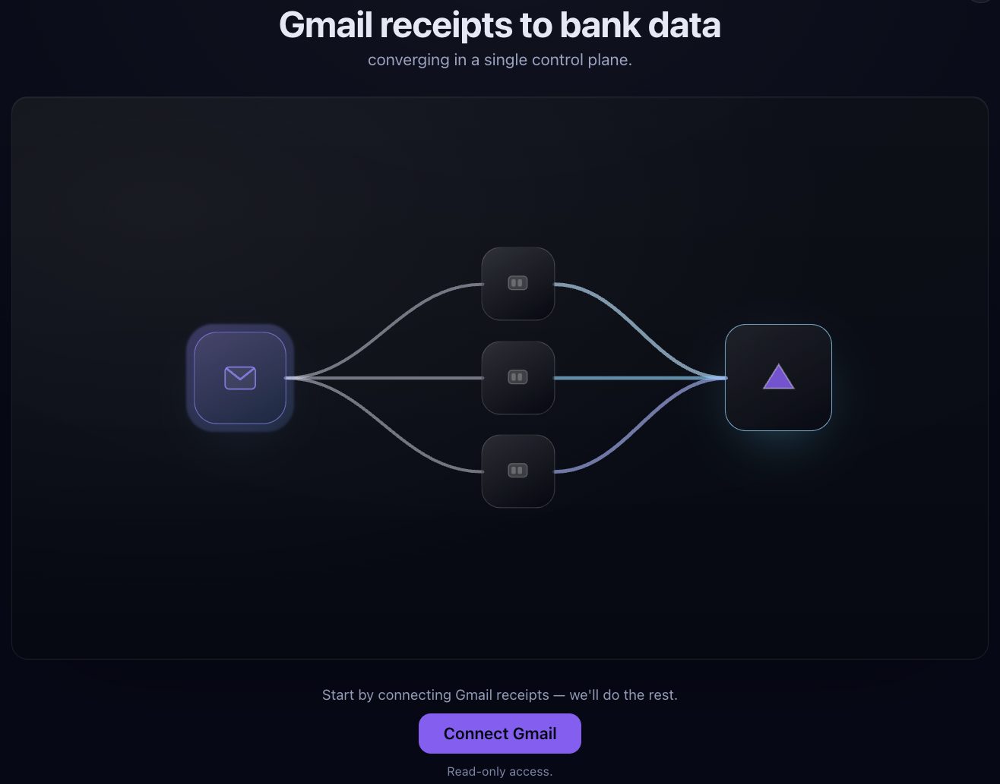
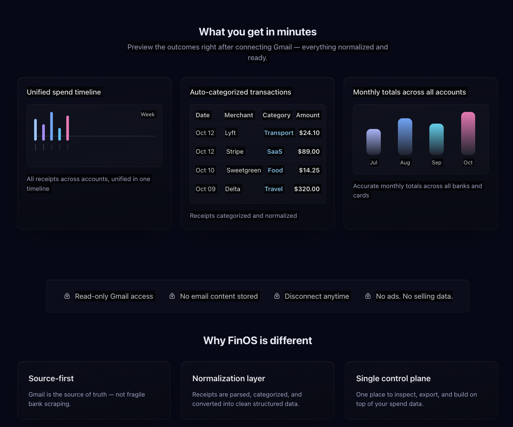
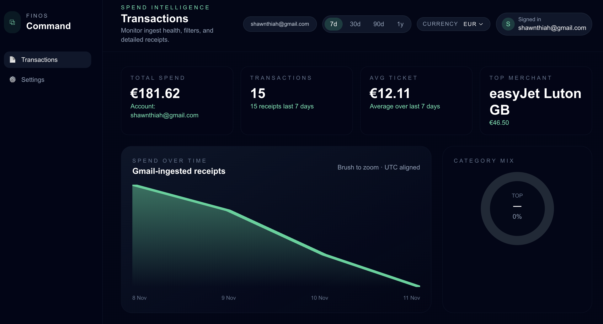

# FinOS

FinOS is a privacy-first personal finance assistant.  
It connects to your Gmail inbox, extracts purchase receipts with the help of an LLM, and serves a dashboard that lets you review spending without sending data to a third-party service.

---

## Visuals



> yeah i know... i spend quite alot :,)

---

## 1. What’s inside?

| Component | Description | Tech |
| --------- | ----------- | ---- |
| `backend/` | Rust service that handles Google OAuth, receipt ingestion, JWT auth, and MongoDB persistence. | Axum, Tokio, MongoDB, Ollama, Google OAuth |
| `frontend/` | Next.js Progressive Web App for visualizing receipts and managing accounts. | Next.js 15, React 19, Chakra UI |

The backend exposes a REST API protected by JWT session tokens. A background job periodically syncs mailboxes and stores new transactions. The frontend consumes those APIs and can be installed as a PWA.

---

## 2. High-level flow

```
User → Google OAuth (PKCE)
     → FinOS backend issues JWT + stores Gmail tokens
     → Background job pulls unread emails via Gmail API
     → Ollama converts receipt emails into structured data
     → MongoDB stores users, tokens, receipts
     → Frontend fetches data with JWT-authenticated requests
```

Protected endpoints expect either the `finos_session` cookie or an `Authorization: Bearer <token>` header.

---

## 3. Prerequisites

- Rust toolchain (≥ 1.70)
- Node.js 20+ (for the Next.js app)
- MongoDB instance
- Ollama installed with the model referenced by `OLLAMA_MODEL`
- Google Cloud project with Gmail API enabled and a downloaded `client_secret_web.json`

---

## 4. Configuration

Create `backend/.env` (copy from `.env-example` if available) and define:

```env
MONGO_URI=mongodb://localhost:27017
DATABASE=fin-os-db
OLLAMA_MODEL=llama3.1
ISSUER_EMAILS=["receipts@example.com","orders@merchant.com"]
JWT_SECRET=super-secret-change-me
```

Place `client_secret_web.json` in `backend/` (contains the Google OAuth credentials).  
The redirect URI you configure in Google Cloud must match the one served by the backend (`http://localhost:3000/auth/google/callback` during local development).

If the frontend needs runtime configuration (e.g. API base URL), create `frontend/.env.local` with keys such as:

```env
NEXT_PUBLIC_API_BASE_URL=http://localhost:3000
```

---

## 5. Running locally

1. **Start the backend**
   ```bash
   cd backend
   cargo run
   ```
   The service listens on `http://localhost:3000`, merges auth + receipt routes, and spawns the ingestion job (interval configurable via `start_sync_job`).

2. **Start the frontend**
   ```bash
   cd frontend
   npm install    # or pnpm install
   npm run dev    # runs Next.js dev server on port 3001 by default if 3000 is taken
   ```

3. Visit the frontend (`http://localhost:3001`) and follow the Google sign-in prompt. After OAuth completes, a session JWT is stored and subsequent requests to protected endpoints succeed.

Make sure Ollama is running (`ollama serve`) and that the configured model is pulled (`ollama pull llama3.1`).

---

## 6. Repository structure

```
finOS/
├── backend/
│   ├── src/
│   │   ├── common/    # app state, JWT helpers, Mongo connector
│   │   ├── domain/    # auth, email, ingestor, receipt, user
│   │   └── main.rs    # entrypoint, background job launcher
│   └── README.md      # backend-specific documentation
└── frontend/
    ├── src/           # Next.js app routes & components
    └── README.md      # frontend notes
```

Consult the component READMEs for API details and development tips.

---

## 7. Authentication & security notes

- Google OAuth tokens are persisted in Mongo via `TokenRecord`.
- The backend issues short-lived JWTs signed with `JWT_SECRET` and validates them through middleware (`common::jwt::require_jwt`).
- The receipt API (`/receipts/:email`) demonstrates how to protect routes; replicate the middleware for additional endpoints.
- Rotate `JWT_SECRET` in production and ensure TLS termination before forwarding cookies/headers.

---

## 8. Background ingestion

`app::start_sync_job` schedules `IngestorService::sync_receipts()` on a Tokio interval. Adjust the cadence or swap in a cron scheduler if you need specific run times. Sync logic:

1. Fetch active users from Mongo.
2. Build Gmail search queries based on `last_synced`.
3. Fetch new messages, parse receipts with Ollama.
4. Store transactions and update `last_synced`.

---

## 9. Roadmap & contributions

- Categorisation & budgeting views
- Web push notifications for new receipts
- Multi-provider email connectors (IMAP/Outlook)
- Improved frontend UX (Tailwind layout, charts)

Pull requests and design discussions are welcome. Open an issue with context and proposed changes before large contributions.
